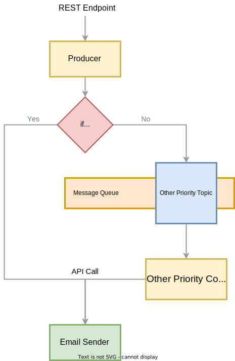

# Email Notification System

## Application Design 
### High Level Design

- Producer:
    - The producer recieves the email data through an exposed endpoint.
    - The producer checks the priority of the mail.
        - If it a high priority mail then it makes an api call to the email sender.
        - If it isn't a high priority email then it sends it to a message queue.
- Consumer:
    - The consumer listens to the message queue from 8am to 8pm on weekdays.
    - After it retrieves the email data it make an api call to the email sender.